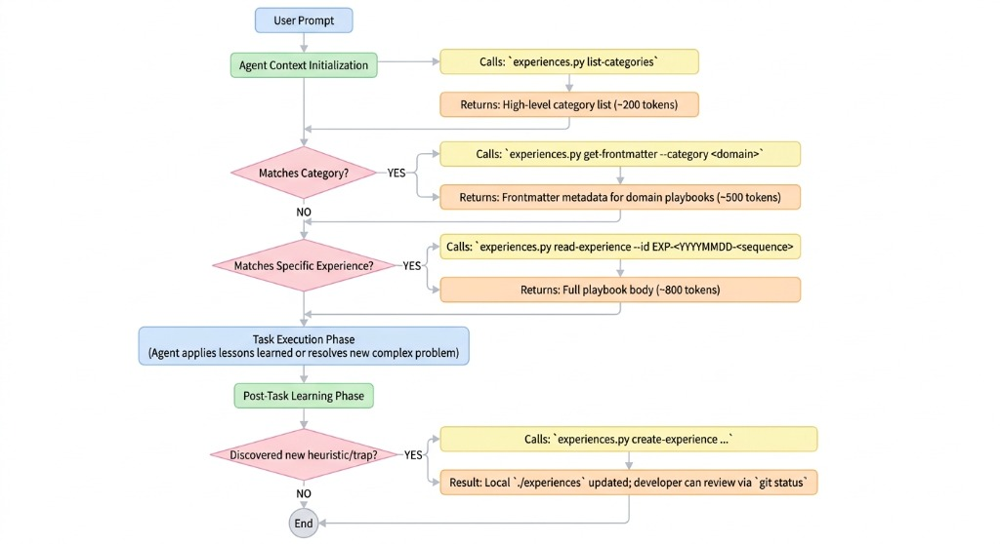

# Open Reasoning Format: Building Self-Learning AI Coding Agents Without Server Infrastructure

When AI coding agents tackle complex tasks, they frequently waste steps making predictable mistakes, misinterpreting environment quirks, or retrying failed approaches before discovering a working path. If an agent encounters a domain-specific trap in one session, there is usually no mechanism to pass that lesson to the next session. The next agent starts from scratch, repeating the exact same trial-and-error cycle.

I created the **[Open Reasoning Format (ORF)](https://github.com/glaforge/open-reasoning-format)** to address this gap. ORF is an open, file-based specification that gives AI agents a lightweight memory mechanism to record and retrieve operational learnings. By giving agents access to structured playbooks derived from past runs, subsequent sessions tackling similar problems can avoid known failure modes, converge on a working solution faster, and consume significantly fewer tokens—often reducing step counts by roughly half and improving success rates.

Here is an overview of why I built ORF, how it works, what I learned from SWE-bench and trajectory evaluations, and the open questions that remain.

---

## Why I Created ORF

The primary objective behind ORF is trajectory optimization. In agentic workflows, execution speed and token efficiency are closely tied to how few unnecessary steps an agent takes. When an agent gets stuck in a trial-and-error loop—for example, misconfiguring a subcommand pipe, corrupting YAML frontmatter, or handling an edge case in file operations—it consumes tokens rapidly while increasing the risk of cascading failures.

I wanted a mechanism where an agent that successfully navigates a trap can record what went wrong and how it solved it, making that experience available to future agent invocations in the same workspace. If an agent can consult past playbooks before attempting a complex change, it can skip known dead ends and follow a validated path on its first attempt.

### Origins and Inspirations

The design of ORF draws from several ideas and past projects:

- **The Reasoning Bank paper (Google):** The concept of explicitly separating procedural knowledge into objectives, execution traps, abstracted insights, and validated resolution paths.
- **Open Knowledge Format (OKF):** The emphasis on human-readable, token-optimized text structures combining Markdown body text with structured YAML frontmatter.
- **Agent Skills Specification (`agentskills.io`):** The design pattern of progressive disclosure, allowing tools and knowledge to be discovered on demand without polluting the agent's baseline system prompt.
- **Antigravity Trajectory Analysis:** This work evolved from an article and CLI tool I previously built to analyze Google Antigravity agent execution logs. Using Gemini, the tool evaluated agent trajectories to identify where steps were wasted and suggested structural instructions to improve future runs.
- **Team Collaboration at Scale:** The idea crystallized further after a discussion with a colleague working at a major bank. We discussed how software engineering teams could capture operational knowledge from agent runs and share those learnings across team members, so that an insight gained by one developer's agent automatically benefits the rest of the team.

---

## Key Characteristics

When designing ORF, I set two explicit constraints:

1. **Zero Server Infrastructure:** ORF relies entirely on local file I/O inside the workspace repository (`./experiences`). It does not require vector databases, embedding APIs, sidecar daemons, or external database servers. It works directly in standard file systems and version control repositories.
2. **Progressive Disclosure:** Injecting hundreds of pages of documentation or past execution logs into an agent's prompt window exhausts token limits and dilutes attention. ORF uses a three-tier retrieval hierarchy:
   - **Tier 1 (Category Catalog):** The agent reads a compact index (`INDEX.md`) listing domain categories (~200 tokens).
   - **Tier 2 (Metadata Inspection):** The agent inspects YAML frontmatter descriptions and trigger conditions for relevant playbooks in a specific domain (~500 tokens).
   - **Tier 3 (Playbook Loading):** The agent reads only the specific playbook file (`EXP-*.md`) matching its active task (~800 tokens).

This approach keeps token overhead low while ensuring the agent receives specific guidance when it encounters matching conditions.

---

## How the ORF System Works

The ORF architecture consists of three components: the experience folder layout, the root category index, the standard playbook file schema, and an agent skill powered by a Python helper script.



```text
.
├── experiences/
│   ├── INDEX.md                           # Root category catalog with YAML frontmatter
│   └── <domain>/                          # Domain directories (e.g., python-scripting)
│       └── EXP-<YYYYMMDD>-<sequence>.md   # Playbook files
└── manage-experience/
    ├── SKILL.md                           # Agent Skill specification (agentskills.io)
    └── scripts/
        └── experiences.py                 # Reference Python CLI script
```

### 1. The Root Category Index (`INDEX.md`)

The `experiences/INDEX.md` file acts as the entry point and primary indirection layer for the entire system. It combines YAML frontmatter defining domain categories (`id`, `name`, `description`) with a Markdown body linking directly to individual experience records alongside one-line summaries. Rather than forcing an agent to traverse directory trees or parse dozens of individual files on startup, reading `INDEX.md` allows the agent to discover available domains and trigger summaries in a single lightweight operation (~200 to 500 tokens). Whenever an agent records a new experience, the helper script automatically appends the entry to `INDEX.md` under its matching category.

### 2. The Playbook Schema (`EXP-*.md`)

Each experience file is written in Markdown with YAML frontmatter. It follows a strict 5-section layout:

```markdown
---
id: "EXP-20260720-0001"
title: "Parse Markdown frontmatter using line-anchored regex"
description: "Trigger when parsing or modifying Markdown files with YAML frontmatter."
domain: "python-scripting"
keywords: [markdown, yaml, frontmatter, regex]
complexity: "medium"
created_at: "2026-07-20"
---

## 1. Objective
Update index files containing YAML frontmatter without stripping headers.

## 2. The Trap
Using basic string split on '---' matches horizontal rules inside the body, corrupting the document.

## 3. Abstracted Insight
> **Core Principle:** Always anchor YAML frontmatter regex matching to line starts (`^---\s*$`).

## 4. Validated Path
Use regex with `re.MULTILINE` flag to match header delimiters explicitly before splitting content.

## 5. Verification Checklist
- [ ] Verify frontmatter block remains intact after writing updates.
```

### 3. The `manage-experience` Skill

The agent interacts with the experience directory through an `agentskills.io`-compatible skill (`manage-experience/SKILL.md`) backed by `experiences.py`. The skill guides the agent through a two-phase workflow:

- **Phase 1: Progressive Discovery & Retrieval**
  1. `python3 manage-experience/scripts/experiences.py list-categories`  
     Lists active domain categories.
  2. `python3 manage-experience/scripts/experiences.py get-frontmatter --category <domain>`  
     Inspects trigger descriptions for matching playbooks.
  3. `python3 manage-experience/scripts/experiences.py read-experience --id <EXP-ID>`  
     Loads the target playbook's insight, validated path, and verification checklist into context.

- **Phase 2: Post-Task Learning & Experience Recording**  
  After an agent resolves a non-trivial failure mode or complex edge case, it calls `create-experience`:
  ```bash
  python3 manage-experience/scripts/experiences.py create-experience \
    --domain "python-scripting" \
    --title "..." \
    --description "..." \
    --keywords "..." \
    --complexity "medium" \
    --objective "..." \
    --trap "..." \
    --insight "..." \
    --validated-path "..." \
    --checklist-item "..."
  ```
  This command appends the new `EXP-*.md` file and updates `experiences/INDEX.md`.

---

## Evaluation Results: SWE-bench Lite & Trajectory Benchmarks

To empirically measure the impact of ORF, I evaluated AI agents across benchmark scenarios and SWE-bench Lite instances using a 3-stage evaluation harness (Cold Run baseline vs. Warm Run with ORF playbooks).

### 1. Task Success Rate Improvement (SWE-bench Lite)

In benchmark evaluations on SWE-bench Lite problem sets running in isolated Podman container environments:

| Metric | Cold Run (Baseline / No ORF) | Warm Run (With ORF) | Efficacy Delta |
| :--- | :--- | :--- | :--- |
| **Tasks Resolved** | 2 / 3 | 3 / 3 | +1 task resolved |
| **Pass Rate** | 66.7% | **100.0%** | **+33.3%** |

On the baseline Cold Run, the agent failed to resolve 1 out of 3 tasks because it got trapped in an environment configuration error loop. On the Warm Run—equipped with an ORF playbook recorded from a prior resolution—the agent retrieved the insight upfront, avoided the trap, and achieved a **100% pass rate**.

### 2. Step Count Reduction & Trajectory Efficiency

Comparing agent execution trajectories across specific scenarios:

| Scenario | Cold Success | Cold Steps | Warm Success | Warm Steps | Step Reduction | Debug Error Loops |
| :--- | :--- | :--- | :--- | :--- | :--- | :--- |
| `frontmatter-parser` | ✅ | 25 steps | ✅ | 12 steps | **52.0%** | **0 loops (down from 4)** |

Key observations from the trajectory logs:
- **52% Reduction in Step Count:** On `frontmatter-parser`, step count dropped from 25 steps down to 12 steps.
- **First-Attempt Convergence:** In the Cold Run, the agent spent 4 step cycles debugging string splitting edge cases. In the Warm Run, the agent loaded `EXP-20260720-0001.md`, cited the core principle in its initial code edit, and passed verification on the first attempt.
- **Direct Token Savings:** Cutting step counts by half translated into a proportional reduction in token usage and execution wall-clock time.

---

## Installing the Skill in Your AI Agent

To enable ORF support in an agent framework that supports `agentskills.io` (such as Google Antigravity):

1. Copy the `manage-experience/` directory into your project root or your agent's skills location.
2. Ensure your execution environment has Python 3.10+ and `PyYAML` installed:
   ```bash
   pip install pyyaml
   ```
3. Initialize or prompt your host agent. The agent will discover `manage-experience/SKILL.md` and use it during Phase 1 (task startup) and Phase 2 (task completion).

---

## Creating Scenarios and Running Evaluation Tests

To measure how ORF impacts agent performance on your own tasks, the repository includes an evaluation harness in `./evals`:

```bash
# 1. Run dry-run verification of benchmark scenarios
python3 evals/runner.py --dry-run

# 2. Run live A/B evaluations using the local Antigravity CLI (agy)
python3 evals/runner.py --agy

# 3. Export Markdown and JSON benchmark reports
python3 evals/runner.py --agy \
  --export-markdown evals/reports/agy_report.md \
  --export-json evals/reports/agy_report.json
```

The runner executes a 3-stage benchmark:
1. **Stage 1 (Cold Run):** Evaluates baseline performance without prior experience and tests whether the agent records a new experience upon resolving a trap.
2. **Stage 2 (Spec Validation):** Audits generated `EXP-*.md` files against the ORF schema rules.
3. **Stage 3 (Warm Run):** Runs a fresh agent instance with access to the newly recorded experience, measuring step reduction and trap avoidance.

---

## Open Questions

While ORF provides a functional baseline for file-based agent memory, several open questions remain for future exploration:

1. **Experience Consolidation:** Over time, agents may generate multiple overlapping playbooks within the same domain. How should we consolidate, deduplicate, or summarize accumulated experiences without manual intervention?
2. **Knowledge Staleness & Lifecycle:** An experience recorded today might become obsolete as libraries, language models, or frameworks update. How should agents detect when a stored *Validated Path* is no longer accurate?
3. **Team Collaboration & Distribution:** What is the best way to share experiences across a development team? Should team members check `experiences/` files directly into Git repositories, or should mature experiences be periodically distilled into shared agent skills?

---

If you are building or working with AI coding agents, I invite you to explore the [Open Reasoning Format repository on GitHub](https://github.com/glaforge/open-reasoning-format), read the [ORF Specification](SPECIFICATION.md), experiment with the `./manage-experience` skill, and try running your own benchmark scenarios.
