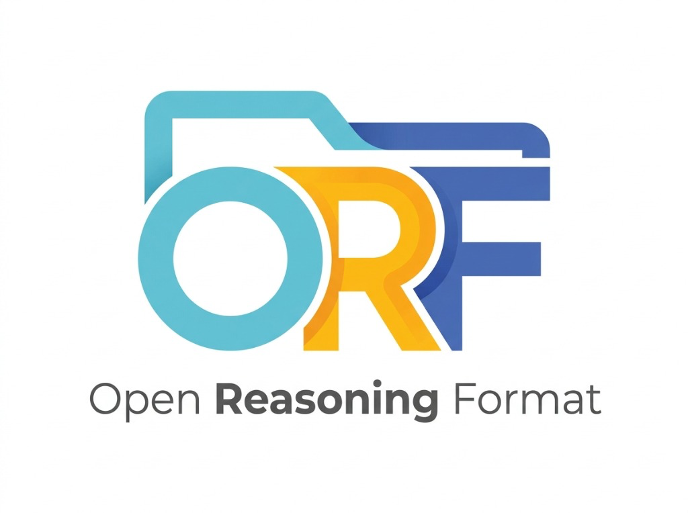

<p align="center">
  
</p>

# Open Reasoning Format (ORF)

**Version:** 0.1.0  
**Status:** Draft  
**Specification:** [SPECIFICATION.md](SPECIFICATION.md)

The **Open Reasoning Format (ORF)** defines a lightweight, file-based memory architecture for AI agents. It synthesizes principles from:
- **[The Reasoning Bank paper](https://arxiv.org/abs/2509.25140) (Google):** Procedural knowledge, abstracted heuristics, and execution traps learned through experience.
- **[Open Knowledge Format (OKF)](https://github.com/GoogleCloudPlatform/knowledge-catalog/blob/main/okf/SPEC.md):** Human-readable, token-optimized Markdown and YAML.
- **[Agent Skills Specification](https://agentskills.io/):** Progressive disclosure and zero-runtime indirection layers.

---

## 🚀 Key Features

- **Zero Runtime Infrastructure:** Operates via local workspace file I/O (`./experiences`), requiring no vector databases or external server processes.
- **Progressive Disclosure:** Agents query high-level category metadata (~200 tokens) before fetching targeted experience playbooks (~800 tokens), optimizing context window usage.
- **Standardized Schema:** 5-section Markdown architecture with YAML frontmatter for explicit indexing and trigger conditions.
- **Agent Skill Ready:** Interoperable with [agentskills.io](https://agentskills.io/) via the included `manage-experience` skill and reference CLI tool.

---

## 📁 Repository Structure

```text
.
├── AGENTS.md                              # AI agent operational guidelines
├── README.md                              # Overview and usage instructions
├── SPECIFICATION.md                       # Full ORF v0.1.0 Specification
├── requirements.txt                        # Python dependencies (PyYAML)
├── experiences/
│   ├── INDEX.md                           # Root category index & indirection layer
│   └── python-scripting/                  # Domain directory
│       ├── EXP-20260720-0001.md           # Frontmatter parsing playbook
│       ├── EXP-20260720-0002.md           # Atomic file storage playbook
│       └── EXP-20260720-0003.md           # Subprocess pipe deadlock playbook
├── manage-experience/
│   ├── SKILL.md                           # Agent Skill Specification (agentskills.io)
│   └── scripts/
│       └── experiences.py                 # Reference Python helper CLI script
├── evals/                                 # Trajectory Evaluation & A/B Testing Framework
│   ├── README.md                          # Evaluation harness & scenario authoring guide
│   ├── runner.py                          # Evaluation CLI benchmark runner
│   ├── harness/                           # Sandbox, evaluator, and spec validator
│   ├── scenarios/                         # Isolated scenario benchmarks (problem.md & test_verify.py)
│   └── reports/                           # Exported evaluation matrix reports (Markdown / JSON)
└── tests/
    └── test_experiences.py                # Automated unit test suite
```


---

## 🛠️ Getting Started

### Prerequisites

- Python 3.10+
- PyYAML (`pip install -r requirements.txt`)

```bash
pip install -r requirements.txt
```

---

## 💡 Using the Helper CLI (`experiences.py`)

The reference implementation script provides deterministic file I/O operations for viewing and creating experience records.

### 1. List Available Categories

```bash
python3 manage-experience/scripts/experiences.py list-categories
```

### 2. Inspect Experience Metadata in a Domain Category

```bash
python3 manage-experience/scripts/experiences.py get-frontmatter --category python-scripting
```

### 3. Read a Specific Experience Record

```bash
python3 manage-experience/scripts/experiences.py read-experience --id EXP-20260720-0001
```

### 4. Record a New Experience

```bash
python3 manage-experience/scripts/experiences.py create-experience \
  --domain "cloud-run" \
  --title "Set explicit memory limit on container deployment" \
  --description "Trigger when deploying containerized apps to Cloud Run experiencing OOM kills." \
  --keywords "cloud-run,container,memory,oom" \
  --complexity "medium" \
  --objective "Deploy service to Cloud Run without container OOM restarts." \
  --trap "Default 512MiB allocation caused container crashes under load." \
  --insight "Always set memory limit to at least 1GiB for Node/Python runtimes during initial provisioning." \
  --validated-path "Pass --memory 1Gi to gcloud run deploy command." \
  --checklist-item "Verify memory utilization in Cloud Monitoring."
```

## 🧠 The `manage-experience` Skill

The Open Reasoning Format includes a pre-built **Agent Skill** located in [`manage-experience/SKILL.md`](manage-experience/SKILL.md), adhering strictly to the [agentskills.io](https://agentskills.io) specification.

### Skill Overview

- **Name:** `manage-experience`
- **Specification:** `ORF-0.1`
- **Location:** `manage-experience/SKILL.md`
- **Helper Script:** `manage-experience/scripts/experiences.py`
- **Compatibility:** Requires local filesystem read/write permissions and Python 3.10+ (with `PyYAML`).

### Skill Frontmatter Header

```yaml
---
name: manage-experience
description: Dynamically routes, retrieves, and records procedural playbooks from the local `./experiences` folder. Use at the start of complex tasks to consult past experience, and at the end of a successful execution to record new operational learnings.
license: Apache-2.0
compatibility: Requires local file-system read/write permissions and Python 3.10+
metadata:
  version: "0.1.0"
  spec_format: "ORF-0.1"
---
```

### How Agents Utilize the Skill

Host agent frameworks that support the Agent Skills specification automatically discover `manage-experience/SKILL.md` upon initialization. The skill provides step-by-step instructions guiding the agent through a two-phase workflow:


1. **Phase 1: Progressive Discovery & Retrieval**
   - **Step 1 (Category Search):** The agent runs `list-categories` to check if the user prompt matches known domain categories.
   - **Step 2 (Metadata Inspection):** If a category matches, the agent runs `get-frontmatter --category <domain-id>` to inspect triggers and descriptions of relevant experiences (~500 tokens).
   - **Step 3 (Experience Loading):** When a specific trigger condition matches the active task or error trap, the agent runs `read-experience --id EXP-...` to load the full playbook (~800 tokens) into its context.

2. **Phase 2: Post-Task Learning & Experience Recording**
   - After successfully solving a non-trivial problem, handling an unexpected edge case, or finding a domain-specific workaround, the agent runs `create-experience` to append a new `EXP-<YYYYMMDD>-<sequence>.md` file and automatically update `experiences/INDEX.md`.

---

## 🤖 Integration with AI Agent Frameworks

ORF experiences can be loaded dynamically into any agent framework that supports local tool calling or skill execution.

### Execution Lifecycle

1. **Category Retrieval:** Call `list-categories` to check if past experiences match the user task domain.
2. **Metadata Inspection:** Call `get-frontmatter --category <domain-id>` to find matching playbooks or traps.
3. **Experience Retrieval:** Call `read-experience --id EXP-...` to inject the *Abstracted Insight* and *Validated Path* into the prompt context.
4. **Learning & Post-Task Recording:** After resolving a complex issue or trap, call `create-experience` to store the operational learning for future runs.

---

## 📊 Trajectory Evaluation & A/B Testing Framework

ORF includes a built-in evaluation harness (`./evals`) to empirically measure whether experience playbooks improve AI agent trajectories, reduce step counts, eliminate trial-and-error debugging cycles, and validate dynamic experience recording.

### 3-Stage Evaluation Pipeline

```text
[ Stage 1: Cold Run ]       -->       [ Stage 2: Spec Validation ]       -->       [ Stage 3: Warm Run ]
Without Prior Experience                Validate New EXP-*.md File                 With Newly Minted EXP
- Measures baseline steps               - Checks YAML frontmatter                  - Evaluates Phase 1 retrieval
- Tests Phase 2 recording               - Audits 5 required sections               - Measures step reduction &
  (`create-experience`)                 - Confirms INDEX.md update                   first-attempt trap avoidance
```

1. **Stage 1 (Cold Run - Baseline)**: An agent attempts a scenario without prior experience playbooks. If it encounters and resolves a trap, we measure whether it automatically triggers **Phase 2** of the skill (`create-experience`) to record a new playbook.
2. **Stage 2 (Spec Validation)**: An automated validator (`spec_validator.py`) audits any dynamically generated `EXP-*.md` file against the 7 required YAML frontmatter fields and 5 mandatory Markdown headers.
3. **Stage 3 (Warm Run - Accelerated Execution)**: A fresh agent context attempts the scenario with the newly recorded playbook available. We evaluate **Phase 1** retrieval (`manage-experience`), first-attempt trap avoidance, and percentage step count reduction.

### Benchmark Scenarios Included

- **`frontmatter-parser`**: Parses and updates Markdown index files without corrupting YAML frontmatter headers block (`EXP-20260720-0001.md`).
- **`atomic-writer`**: Updates JSON state persistent files atomically using temporary files and `os.replace` (`EXP-20260720-0002.md`).
- **`subprocess-pipe`**: Executes CLI subcommands with non-blocking stdout/stderr pipe streaming (`EXP-20260720-0003.md`).

### Running Evaluation Benchmarks

```bash
# 1. Run evaluation scenarios in dry-run verification mode
python3 evals/runner.py --dry-run

# 2. Run live A/B testing benchmarks using local `agy` (Antigravity CLI) binary
python3 evals/runner.py --agy

# 3. Export Markdown and JSON comparative reports
python3 evals/runner.py --agy \
  --export-markdown evals/reports/agy_report.md \
  --export-json evals/reports/agy_report.json
```

---

## 🧪 Running Tests


To verify script parsing, experience generation, and index updates:

```bash
python3 -m unittest discover -s tests
```

---

## 📜 License

Apache-2.0

---

## 📌 Disclaimer

This is not an official Google project.

